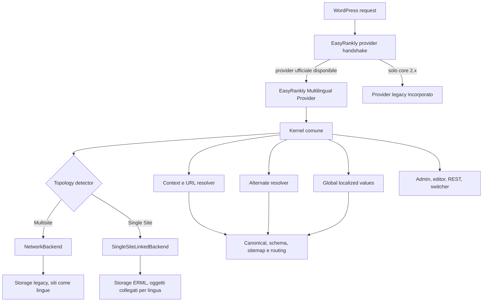

# Architettura

## 1. Obiettivi architetturali

L'architettura DEVE:

- separare completamente la feature dal pacchetto EasyRankly senza interrompere le installazioni Multisite esistenti;
- fornire lo stesso dominio e gli stessi consumer SEO su Single Site e Multisite;
- isolare le differenze di storage, routing e amministrazione nei backend;
- garantire un solo proprietario dell'esecuzione e dell'output;
- mantenere gli oggetti WordPress utilizzabili dopo la disattivazione dell'add-on;
- avere contratti pubblici versionati e testabili, senza dipendere da globali o classi interne del core;
- caricare codice e asset solo quando la feature o una sua superficie sono effettivamente usati.

## 2. Vista d'insieme



Il `Kernel` non contiene condizioni sparse su `is_multisite()`. La factory sceglie una sola implementazione di `BackendInterface` durante il bootstrap; da quel momento i consumer dipendono soltanto dai contratti del dominio.

## 3. Confini dei pacchetti

### 3.1 EasyRankly core

Il core DEVE possedere soltanto:

- API provider v1 e relativo registry;
- modelli di contesto SEO neutrali;
- sanitizzazione finale delle mappe hreflang;
- filtri pubblici per alternate SEO, alternate navigabili, URL localizzato, robots, canonical e schema;
- funzione pubblica per determinare pubblicazione e indicizzabilità secondo le impostazioni EasyRankly correnti;
- extension point generici per impostazioni e superfici editor;
- compatibilità temporanea con il provider incorporato nella linea 2.x.

Il core 3.0 NON DEVE contenere:

- classi `ERankly_ML_*` o equivalenti;
- tabella, opzioni, costanti o cache specifiche del multilingua;
- route REST, shortcode, pannelli, CSS o JavaScript multilingua;
- reset, uninstall o migrazioni dello storage multilingua;
- riferimenti a un resolver globale o a una concreta classe provider.

### 3.2 EasyRankly Multilingual

L'add-on DEVE possedere:

- kernel, backend e storage;
- registro delle lingue e relazioni di traduzione;
- risoluzione del contesto e degli URL;
- emissione hreflang quando ne acquisisce l'ownership;
- impostazioni, schermate, editor, REST, CLI, shortcode/blocco e asset;
- migrazione, adozione, export/import, cache e lifecycle;
- diagnostica e avvisi di dipendenza/conflitto.

L'add-on NON DEVE includere file dal percorso fisico del core né usare costanti `ERANKLY_PATH` o `ERANKLY_URL` per i propri asset.

## 4. Struttura logica dell'add-on

```text
easyrankly-multilingual/
├── easyrankly-multilingual.php
├── uninstall.php
├── src/
│   ├── Bootstrap/
│   ├── Contract/
│   ├── Domain/
│   ├── Kernel/
│   ├── Backend/Network/
│   ├── Backend/SingleSite/
│   ├── Seo/
│   ├── Routing/
│   ├── Admin/
│   ├── Editor/
│   ├── Rest/
│   ├── Frontend/
│   ├── Migration/
│   ├── Export/
│   └── Infrastructure/
├── assets/
├── languages/
└── tests/
```

Questa è una struttura prescrittiva a livello di responsabilità; l'autoload PSR-4 e il layout fisico possono essere adattati alla toolchain del repository purché le dipendenze restino unidirezionali:

`UI / SEO / REST -> Kernel -> Contract <- Backend`.

Un backend NON DEVE dipendere da UI, REST o renderer frontend.

## 5. Bootstrap e arbitraggio del provider

### 5.1 Contratto pubblico del core

EasyRankly 2.1 DEVE esporre prima dell'esecuzione di `plugins_loaded`:

```php
define( 'ERANKLY_EXTENSION_API_VERSION', 1 );

interface ERankly_Multilingual_Provider_Interface {
    public function get_id(): string;
    public function get_version(): string;
    public function get_api_version(): int;
    public function get_priority(): int;
    public function get_topology(): string;
    public function preflight(): bool|WP_Error;
    public function is_enabled(): bool;
    public function register_hooks(): void;
    public function get_context(): array;
    public function get_alternates( array $context, bool $navigable ): array;
    public function localize_url( string $url, array $context ): string;
}

function erankly_register_multilingual_provider(
    ERankly_Multilingual_Provider_Interface $provider
): bool|WP_Error;

function erankly_get_multilingual_provider(): ?ERankly_Multilingual_Provider_Interface;
function erankly_get_extension_api_version(): int;
```

Nomi, tipi di ritorno e semantica costituiscono l'API major 1. Aggiungere argomenti obbligatori o cambiare il significato di un ritorno richiede una nuova major dell'API.

M8 aggiunge in modo strettamente additivo due funzioni pubbliche alla stessa
major:

```php
function erankly_get_localized_value_source_state(
    string $key
): array|WP_Error;

function erankly_update_localized_value_source(
    string $key,
    mixed $value,
    string $expected_fingerprint
): array|WP_Error;
```

La lettura restituisce `contract=erankly-localized-source/1`, `key`, `value`,
`value_hash`, `fingerprint` e `format`. La mutazione restituisce lo stesso stato
verificato più `changed` e `idempotent`. Il registro delle chiavi è chiuso e
non filtrabile: include soltanto sorgenti testuali EasyRankly dichiarate per
Organization, WebSite, pagine speciali e template pubblici di post type e
tassonomie. Non è un writer generico per `erankly_settings`.

Ogni mutazione richiede il fingerprint letto, acquisisce il mutex condiviso
`erankly_ml_ownership_lock`, rilegge lo stato, applica il sanitizer canonico
del setting, aggiorna soltanto la radice allowlisted facendo merge contro lo
snapshot corrente e verifica la rilettura prima di restituire successo. Un
fingerprint stale restituisce
`erankly_localized_value_source_revision_conflict`; un retry o ripristino già
applicato è idempotente anche se il fingerprint presentato è ormai stale.
Errori e checkpoint contengono soltanto chiave, fingerprint, cause e flag
bounded, mai il valore. L'API è Single Site e richiede `manage_options` in
admin, REST o WP-CLI; ogni altro contesto resta fail-closed.

Identificatori e priorità iniziali:

| Provider | ID | Priorità |
|---|---|---:|
| Add-on ufficiale | `easyrankly-multilingual` | 100 |
| Fallback core 2.x | `easyrankly-bundled-multilingual` | -100 |

### 5.2 Sequenza deterministica

1. Il file principale dell'add-on definisce solo costanti, guard e un callback differito. Non carica una classe che implementa un'interfaccia ancora inesistente.
2. A `plugins_loaded` priorità `1`, l'add-on verifica presenza del core, EasyRankly >= 2.1 e API major `1`; solo allora carica le proprie classi e registra il provider.
3. Il core registra il provider fallback della linea 2.x.
4. Il registry chiude le registrazioni e seleziona il provider all'inizio del bootstrap EasyRankly. La priorità serve soltanto a preferire l'unico provider esterno valido al fallback incorporato; due provider esterni validi sono un conflitto e non vengono ordinati automaticamente, salvo un provider ID persistente scelto e verificato dall'amministratore.
5. `preflight()` è read-only. Il provider selezionato registra gli hook una sola volta; `register_hooks()` DEVE essere idempotente.
6. Dopo la chiusura del registry, una registrazione tardiva restituisce `WP_Error` e non altera il runtime.

Il core chiama direttamente `get_context()`, `get_alternates()` e `localize_url()` sul provider selezionato e applica i filtri pubblici **dopo** il risultato del provider. Il provider non registra sé stesso sugli stessi tre filtri: questa regola evita esecuzione doppia e rende i filtri punti di estensione post-provider.

Azioni pubbliche:

```php
do_action( 'erankly_multilingual_provider_registered', $provider );
do_action( 'erankly_multilingual_provider_selected', $provider );
do_action( 'erankly_multilingual_provider_booted', $provider );
do_action( 'erankly_multilingual_provider_rejected', $provider, $error );
```

### 5.3 Regole fail-safe

- Core assente, core < 2.1 o API major incompatibile: add-on dormiente, nessuna scrittura, avviso soltanto in admin.
- Preflight fallito prima dell'adozione: il fallback 2.x PUÒ continuare soltanto se il `WP_Error` dichiara esplicitamente `fallback_allowed=true`. Il default per un errore sconosciuto è fail-closed.
- Storage già `claimed` dall'add-on e preflight fallito: il sistema fallisce chiuso, non avvia il fallback e mostra un errore operativo. Ciò impedisce dual-write.
- Storage `claimed` ma add-on assente o disattivato: il core 2.x legge direttamente il marker, non avvia il fallback e mostra l'istruzione di rollback/riattivazione. Il semplice toggle del plugin non trasferisce ownership.
- Provider selezionato ma feature disabilitata: il provider resta proprietario del runtime e produce output vuoto; il fallback non ricompare.
- Conflitto con un owner multilingua esterno, topologia incerta o schema non verificabile: `fallback_allowed=false`; anche il provider incorporato deve superare il conflict preflight.
- Più provider esterni validi: nessuno viene avviato finché il conflitto non è risolto, salvo una scelta persistente e verificata dell'amministratore.

Un `WP_Error` di preflight contiene sempre `fallback_allowed: bool`, `owner_state: string` e `retryable: bool`. Il ritorno grezzo `false` viene normalizzato in errore fail-closed con tutti i flag false.

## 6. Ownership dell'output

Esiste un solo owner per ciascuna responsabilità:

| Responsabilità | Owner con add-on attivo |
|---|---|
| Lingue, relazioni, contesto | Add-on |
| URL linguistici Single Site | Add-on |
| Mappa alternate | Add-on, poi filtri pubblici |
| Sanitizzazione finale alternate | Core API |
| Tag hreflang in `<head>` | Add-on provider |
| Canonical e meta SEO EasyRankly | Core, usando il contesto del provider |
| Switcher e notice | Add-on |
| Dati e uninstall multilingua | Add-on |

Quando l'add-on è provider, il core NON DEVE emettere un secondo set hreflang. L'add-on deve poter emettere hreflang anche quando EasyRankly sopprime i propri meta perché un altro plugin SEO è owner della pagina. Un'integrazione esplicita può cedere l'output mediante il solo filtro di ownership seguente.

L'arbitraggio usa un identificatore, non un booleano:

```php
$owner = apply_filters(
    'erankly_hreflang_output_owner',
    $selected_provider_id,
    $context,
    $selected_provider_id
);
```

Valori validi sono un provider ID registrato oppure `none`. Un valore sconosciuto produce diagnostica e `none`, mai due renderer.

Il provider selezionato registra un unico callback `wp_head` a priorità `2`. L'owner viene valutato e memoizzato dentro quel callback, dopo che la main query ha congelato il contesto. EasyRankly 2.1 rimuove la chiamata hreflang dal proprio renderer meta aggregato; anche il fallback incorporato usa questo callback indipendente. In presenza di un SEO owner esterno ma nessun owner multilingua, il default resta il provider selezionato. `none` sopprime ogni emissione EasyRankly.

Un plugin multilingua esterno attivo blocca il backend nativo: non sono consentiti due router, due registri di lingua o due emettitori hreflang. Un futuro `ExternalBridgeBackend` potrà consumare un owner esterno, ma non fa parte della 1.x.

## 7. Contratti di dominio

### 7.1 `Language`

```text
Language {
  id: LanguageId              // opaco e stabile; non coincide con locale o slug
  locale: string              // formato WordPress, es. it_IT
  hreflang: string            // BCP 47 normalizzato, es. it-IT
  slug: string                // segmento URL, es. it
  name: string
  nativeName: string
  direction: ltr | rtl
  enabled: bool
  default: bool
  position: int
}
```

`LanguageId` è l'unico identificatore usato nelle relazioni. Modificare locale, hreflang o slug non cambia l'identità della lingua.

Nel dominio e nelle API pubbliche `LanguageId` è una stringa: UUID nel Single Site e `network:{network_id}:{blog_id}` nel backend Network. Il `BIGINT language_id` delle tabelle Single Site è una chiave interna del repository e non lascia il layer di persistenza. Impostazioni, REST ed export referenziano l'UUID.

La proprietà `default` è calcolata confrontando l'ID con `default_language_uuid`; non viene persistita nella riga lingua.

### 7.2 `EntityRef`

```text
EntityRef {
  topology: site | network
  siteId: int
  kind: post | term | site_root
  objectId: int
  subtype: string
}
```

`subtype` identifica post type o taxonomy. `site_root` con ID `0` è ammesso soltanto dal backend Network per adattare l'object type legacy `home`. Il backend Single Site accetta nel repository soltanto `post|term`; una front page statica usa il backing post/page, mentre le route virtuali non hanno `EntityRef`. Ogni adapter deve produrre lo stesso valore normalizzato per la stessa entità.

### 7.3 `LanguageContext`

```text
LanguageContext {
  languageId: LanguageId
  source: path | query | object | site | default | explicit
  routeKind: singular | home | posts_page | archive | search | 404 | feed
  entity: EntityRef | null
  requestedUrl: absolute-url
  preview: bool
}
```

Sul frontend Single Site la risoluzione avviene in due fasi. Prima della query: override interno autorizzato, variabile di routing validata, lingua predefinita. Questa lingua congela lo scope della main query. Dopo il lookup, la lingua assegnata all'oggetto è soltanto una validazione: non può cambiare il contesto scelto dalla URL. In admin, REST `edit`, preview firmate e operazioni dirette per ID, la lingua dell'oggetto può invece inizializzare un contesto esplicito. Nel backend Network la precedenza è: blog corrente abilitato, mappa sito-lingua, locale del sito come fallback diagnostico.

`routeKind` descrive la semantica della richiesta, mentre `entity` è l'eventuale backing object. Una front page statica ha `routeKind=home` e un `EntityRef` di tipo post/page; una home “ultimi articoli”, search, 404, feed o archive non ha backing row artificiale.

I metodi di assegnazione/gruppo rifiutano ogni kind non supportato dal backend. Le entità virtuali passano soltanto da `ContextResolverInterface` e `UrlResolverInterface::for_route()` e non sono persistibili come traduzioni Single Site.

### 7.4 Gruppi e invarianti

Un `TranslationGroup` rappresenta una sola entità semantica:

- ogni oggetto appartiene al massimo a un gruppo;
- un gruppo contiene al massimo un oggetto per lingua;
- tutti i membri hanno lo stesso `kind` e un `subtype` compatibile;
- collegare un oggetto già collegato è un'operazione esplicita di move, non una duplicazione silenziosa;
- cancellare o cestinare un membro non cancella gli altri;
- un gruppo con meno di due membri PUÒ essere compattato senza cambiare l'assegnazione linguistica dell'oggetto restante.

### 7.5 Interfacce interne minime

```php
interface BackendInterface {
    public function topology(): string;
    public function languages(): LanguageRegistryInterface;
    public function translations(): TranslationRepositoryInterface;
    public function contexts(): ContextResolverInterface;
    public function urls(): UrlResolverInterface;
    public function lifecycle(): OwnershipLifecycleInterface;
}

interface LanguageRegistryInterface {
    public function all(): array;
    public function enabled(): array;
    public function default(): Language;
    public function find( LanguageId $id ): ?Language;
    public function from_slug( string $slug ): ?Language;
}

interface ContextResolverInterface {
    public function preliminary( array $request ): LanguageContext;
    public function freeze( LanguageContext $preliminary, ?EntityRef $entity ): LanguageContext;
    public function current(): LanguageContext;
}

interface UrlResolverInterface {
    public function for_entity( EntityRef $entity, LanguageId $language ): string;
    public function for_route( string $route_kind, LanguageId $language, array $args = array() ): string;
    public function canonicalize_request( LanguageContext $context ): string;
}

interface TranslationRepositoryInterface {
    public function language_of( EntityRef $entity ): ?LanguageId;
    public function assign_language( EntityRef $entity, LanguageId $language, int $expected_object_revision ): void;
    public function group_of( EntityRef $entity ): ?TranslationGroup;
    public function mutate( TranslationMutationCommand $command ): ?TranslationGroup;
    public function translations_of( EntityRef $entity ): array;
}

final class TranslationMutationCommand {
    public function __construct(
        public string $operation, // link, move, replace, unlink.
        public EntityRef $entity,
        public LanguageId $language,
        public ?GroupId $source_group,
        public ?GroupId $target_group,
        public ?EntityRef $expected_replaced_member,
        public int $expected_object_revision,
        public int $expected_source_group_revision,
        public int $expected_target_group_revision
    ) {}
}

interface AlternateResolverInterface {
    public function seo( LanguageContext $context ): array;
    public function navigable( LanguageContext $context ): array;
}

interface OwnershipLifecycleInterface {
    public function prepare_adoption(): array|WP_Error;
    public function verify_adoption( string $lease_token ): array|WP_Error;
    public function claim( string $lease_token, int $expected_marker_revision, string $expected_fingerprint ): bool|WP_Error;
    public function prepare_rollback(): array|WP_Error;
    public function rollback( string $lease_token, int $expected_marker_revision ): bool|WP_Error;
}
```

Le implementazioni possono usare value object o array compatibili con WordPress; i test di contratto DEVONO essere eseguiti contro entrambi i backend.

`GroupId` è l'UUID pubblico nel Single Site e l'ID gruppo legacy incapsulato nel backend Network. Per un oggetto o gruppo non ancora esistente la revisione attesa è `0`. Ogni mutazione incrementa la revisione della riga oggetto e di tutti i gruppi toccati; una move verifica source e target, mentre replace verifica target e identità del membro sostituito prima di scrivere.

`OwnershipLifecycleInterface` appartiene alla superficie admin/CLI dell'add-on, non al percorso frontend. Il claim avviene in una richiesta amministrativa con il fallback in maintenance-readonly; dopo successo esegue redirect e il bootstrap della richiesta successiva seleziona l'add-on e chiama `register_hooks()`. Nessun hook runtime add-on viene avviato prima del CAS a `claimed`.

## 8. Payload pubblici del core

Il contesto passato ai filtri pubblici ha forma:

```php
array(
    'language_id'    => 'language-uuid-or-network-id',
    'hreflang'       => 'it-IT',
    'kind'           => 'post',
    'route_kind'     => 'singular',
    'object_id'      => 123,
    'object_subtype' => 'page',
    'blog_id'        => 1,
    'url'            => 'https://example.test/it/pagina/',
    'locale'         => 'it_IT',
    'is_preview'     => false,
)
```

Gli hook esistenti vengono estesi in modo retrocompatibile: i primi argomenti non cambiano e i callback registrati per un solo argomento continuano a funzionare.

```php
$alternates = apply_filters(
    'erankly_hreflang_alternates',
    $alternates,
    $context,
    $provider_id
);

$navigable = apply_filters(
    'erankly_navigable_hreflang_alternates',
    $navigable,
    $context,
    $provider_id
);

$url = apply_filters(
    'erankly_localized_url',
    $url,
    $context,
    $provider_id
);
```

La mappa alternate normalizzata è:

```php
array(
    'it-IT'     => 'https://example.test/it/pagina/',
    'en-US'     => 'https://example.test/en/page/',
    'x-default' => 'https://example.test/it/pagina/',
)
```

Il core 2.1 DEVE esporre il seguente contratto congelato:

```php
function erankly_get_object_seo_state( array $context ): array;
```

Input obbligatorio: `kind`, `object_id`, `object_subtype`, `blog_id` e `url`; sono validi `post`, `term`, `home`, `posts_page`, `archive` e `other`. Se `blog_id` è diverso dal corrente, il core esegue e bilancia lo switch oppure restituisce stato non esistente quando non è accessibile.

Output esatto:

```php
array(
    'exists'            => true,
    'published'         => true,
    'public'            => true,
    'indexable'         => true,
    'canonical_url'     => 'https://example.test/it/pagina/',
    'canonical_is_self' => true,
    'reason_codes'      => array(),
)
```

Tutte le chiavi sono sempre presenti. `canonical_url` è stringa vuota se non risolvibile; `reason_codes` è una lista stabile di codici macchina, non messaggi localizzati. La funzione incorpora tri-state robots, default globali, stato WordPress e canonical EasyRankly; il provider non legge direttamente meta legacy come `_erankly_noindex`.

Per consentire valori globali localizzati senza dipendere da funzioni interne, il core 2.1 DEVE applicare i seguenti filtri finali e retrocompatibili:

```php
$value = apply_filters(
    'erankly_setting_value',
    $value,
    $key,
    $default_value,
    $context
);

$map = apply_filters(
    'erankly_global_entity_meta_map',
    $map,
    $setting_key,
    $context
);

$special = apply_filters(
    'erankly_site_special_meta',
    $special,
    $context
);
```

`$context` è il payload normalizzato del provider o un array vuoto. Il filtro esistente `erankly_schema` resta il punto finale per rendere coerenti i nodi del grafo. L'add-on può sostituire soltanto chiavi registrate e usa il valore già passato come sorgente, senza richiamare ricorsivamente l'accessor filtrato.

## 9. Backend Multisite

### 9.1 Modello

Una lingua corrisponde a un blog della rete. `LanguageId` è derivato in modo stabile dall'ID rete e blog; il mapping hreflang resta in `erankly_ml_sites`.

### 9.2 Storage zero-copy

L'add-on adotta senza rinominare o copiare:

- `{$wpdb->base_prefix}erankly_ml_relations`;
- site option `erankly_ml_sites`;
- site option `erankly_ml_db_version`;
- site option `erankly_ml_cache_generation`.

Schema legacy della tabella:

```text
id, group_id, blog_id, object_type, object_id, updated_at
```

L'adapter conserva il vincolo attuale di un membro per blog per gruppo. Qualsiasi evoluzione dello schema richiede una migrazione separata e reversibile dopo la release 1.0.

Per serializzare le mutazioni senza alterare la tabella adottata, l'add-on può creare la sidecar `{$wpdb->base_prefix}erml_network_group_revisions`, con chiave `(network_id, group_id)`, `revision` e `updated_at`. La relazione resta interamente nella tabella legacy; la sidecar contiene solo lock/revision posseduti dall'add-on ed è ignorata dal fallback. Replace e move acquisiscono la riga di revisione, verificano la revisione attesa e aggiornano relazione + revisione nella stessa transazione quando le tabelle sono transazionali. Il preflight blocca le mutazioni se non può garantire un mutex equivalente.

### 9.3 Topologie

Devono essere supportate reti a sottodirectory, sottodomini e domini mappati. Le query amministrative DEVONO essere paginate e non possono usare un limite fisso di 200 siti. Su installazioni multi-network il marker è per network, mentre la tabella fisica è condivisa: una cancellazione globale è vietata finché almeno una rete ne dichiara l'uso.

## 10. Backend Single Site

### 10.1 Modello

Ogni traduzione è un oggetto WordPress distinto. L'add-on non sostituisce `post_content` e non salva varianti linguistiche dello stesso post in un blob.

### 10.2 Tabelle

Il backend Single Site usa il prefisso del sito e tabelle possedute esclusivamente dall'add-on:

#### `{$wpdb->prefix}erml_languages`

| Colonna | Tipo logico | Vincolo |
|---|---|---|
| `id` | BIGINT UNSIGNED | PK auto increment |
| `uuid` | CHAR(36) | unique, identità pubblica immutabile |
| `locale` | VARCHAR(35) | non vuoto |
| `hreflang` | VARCHAR(35) | unique, normalizzato |
| `slug` | VARCHAR(35) | unique, lowercase |
| `name` | VARCHAR(100) | non vuoto |
| `native_name` | VARCHAR(100) | non vuoto |
| `direction` | VARCHAR(3) | `ltr` o `rtl` |
| `is_enabled` | TINYINT(1) | default 1 |
| `position` | INT | ordinamento stabile |
| `revision` | BIGINT UNSIGNED | optimistic locking, default 1 |
| `created_at`, `updated_at` | DATETIME | UTC |

La lingua predefinita è referenziata per UUID nelle impostazioni. In questo modo il vincolo “esattamente una” non dipende da una partial unique key non portabile in MySQL.

#### `{$wpdb->prefix}erml_translation_groups`

| Colonna | Tipo logico | Vincolo |
|---|---|---|
| `id` | BIGINT UNSIGNED | PK auto increment |
| `uuid` | CHAR(36) | unique, identità REST/export |
| `object_type` | VARCHAR(20) | `post` o `term` in 1.x |
| `object_subtype` | VARCHAR(64) | post type o taxonomy |
| `revision` | BIGINT UNSIGNED | optimistic locking, default 1 |
| `created_at`, `updated_at` | DATETIME | UTC |

#### `{$wpdb->prefix}erml_object_languages`

| Colonna | Tipo logico | Vincolo |
|---|---|---|
| `id` | BIGINT UNSIGNED | PK auto increment |
| `object_type` | VARCHAR(20) | indicizzato |
| `object_subtype` | VARCHAR(64) | indicizzato |
| `object_id` | BIGINT UNSIGNED | ID WordPress |
| `language_id` | BIGINT UNSIGNED | FK logica a languages |
| `group_id` | BIGINT UNSIGNED NULL | FK logica a groups |
| `revision` | BIGINT UNSIGNED | optimistic locking, default 1 |
| `created_at` | DATETIME | UTC |
| `updated_at` | DATETIME | UTC |

Chiavi obbligatorie:

- unique `(object_type, object_id)`;
- unique `(group_id, language_id)`; i valori `NULL` permettono oggetti assegnati ma non collegati;
- index `(language_id, object_type, object_subtype, object_id)`;
- index `(group_id)`.

#### `{$wpdb->prefix}erml_localized_values`

| Colonna | Tipo logico | Vincolo |
|---|---|---|
| `id` | BIGINT UNSIGNED | PK auto increment |
| `value_key` | VARCHAR(191) | chiave registrata |
| `key_hash` | CHAR(64) | indice stabile della chiave |
| `language_id` | BIGINT UNSIGNED | lingua |
| `value_format` | VARCHAR(20) | `text`, `textarea`, `url`, `html`, `json` |
| `value` | LONGTEXT | valore sanitizzato secondo formato |
| `source_hash` | CHAR(64) | rileva modifica della sorgente |
| `state` | VARCHAR(20) | `translated` o `needs_review` |
| `updated_by` | BIGINT UNSIGNED | user ID, 0 per sistema |
| `created_at` | DATETIME | UTC |
| `updated_at` | DATETIME | UTC |

Chiave unique `(language_id, key_hash)`; il repository verifica anche la chiave originale per proteggere da collisioni. Non sono ammesse chiavi arbitrarie dal browser: una chiave deve essere registrata dal core o da un'integrazione server-side con schema, capability e callback di sanitizzazione.

`json` è ammesso soltanto per chiavi con JSON Schema server-side registrato. Il repository valida e salva una serializzazione canonica; al rendering restituisce strutture decodificate, mai JSON non verificato. Il formato `html` richiede una policy `wp_kses` dichiarata dalla chiave.

Per valori già posseduti da WordPress o EasyRankly, la lingua default continua a usare lo storage sorgente e questa tabella contiene gli override delle lingue non-default. Per valori nativi dell'add-on il registry può dichiarare storage `all-localized`. Cambiare default materializza il vecchio valore sorgente come override e promuove il valore della nuova lingua nel suo storage canonico mediante job journaled.

#### `{$wpdb->prefix}erml_translation_operations`

Journal di idempotenza/compensazione per create blank/duplicate:

| Colonna | Tipo logico | Vincolo |
|---|---|---|
| `id` | BIGINT UNSIGNED | PK auto increment |
| `idempotency_key` | CHAR(36) | unique |
| `request_hash` | CHAR(64) | stesso key = stesso payload |
| `source_type`, `source_id` | VARCHAR(20), BIGINT | source ref |
| `target_language_id` | BIGINT UNSIGNED | lingua target |
| `mode` | VARCHAR(20) | `blank` o `duplicate` |
| `state` | VARCHAR(20) | pending/created/linked/completed/compensating/failed |
| `created_object_id` | BIGINT UNSIGNED | 0 finché assente |
| `result_group_uuid` | CHAR(36) | risultato, nullable logico |
| `error_code` | VARCHAR(100) | codice macchina, nessun contenuto |
| `initiated_by` | BIGINT UNSIGNED | user ID |
| `expires_at`, `created_at`, `updated_at` | DATETIME | UTC |

Index `(state, expires_at)`. Un key riusato con hash diverso restituisce conflitto. Le operazioni terminali restano almeno 7 giorni per retry; il cron elimina soltanto terminali scadute. Uno stato non terminale o con draft da compensare non scade finché audit/cleanup non lo risolve.

L'integrità referenziale viene garantita da chiavi uniche, operazioni atomiche e verificatori applicativi; non si presume che ogni hosting consenta foreign key. Le mutazioni concorrenti devono usare transazioni InnoDB quando disponibili e retry deterministico su duplicate key.

### 10.3 Opzioni

| Opzione | Scope | Uso |
|---|---|---|
| `erml_settings_v1` | site | `default_language_uuid`, `x_default_mode`, `x_default_language_uuid`, routing, mappe home/blog/menu e feature flags |
| `erml_db_version` | site | versione schema |
| `erml_cache_generation` | site | invalidazione globale |
| `erml_assignment_migration_v1` | site | journal batch degli oggetti esistenti |
| `erml_remove_data_on_uninstall` | site | consenso esplicito, default false |

`erml_settings_v1` è un envelope CAS con forma minima:

```php
array(
    'revision' => 1,
    'values'   => array(
        'default_language_uuid'   => '...',
        'x_default_mode'          => 'language',
        'x_default_language_uuid' => '...',
        'prefix_default'          => false,
        'front_page_map'          => array( 'language-uuid' => 42 ),
        'posts_page_map'          => array( 'language-uuid' => 43 ),
        'menu_location_map'       => array( 'primary' => array( 'language-uuid' => 10 ) ),
    ),
)
```

PATCH lingua aggiorna con `WHERE uuid = ... AND revision = expected`; PATCH settings usa mutex/CAS sull'envelope e incrementa `revision`. La stessa regola vale per `erml_network_settings_v1`. Una revisione stale restituisce 409 con snapshot corrente, mai last-write-wins.

Lingua e relazioni non vengono duplicate in post/term meta. Se una futura integrazione necessita meta incidentali, usa `_erml_*`, mai `_erankly_*`, e li dichiara nel proprio lifecycle.

`x_default_mode` è `disabled` oppure `language`; nel primo caso l'UUID è `null`, nel secondo è obbligatorio. Il default iniziale è `language` verso la lingua predefinita. Una root neutrale/selettore indipendente è fuori scope 1.x perché richiede un proprio contratto di canonical, indicizzabilità e sitemap.

Il backend Network usa una site option separata `erml_network_settings_v1`, almeno con `enabled` e preferenze frontend. Al claim importa una sola volta il toggle legacy e ne conserva lo snapshot; da quel momento `is_enabled()` legge l'opzione add-on. Un rollback verificato trasferisce prima l'ownership al core mantenendo il toggle off e soltanto dopo ripristina/verifica nel toggle core il valore corrente.

### 10.4 Slug

La 1.x conserva l'unicità degli slug imposta da WordPress. Il prefisso lingua non implica supporto a due post fratelli con lo stesso `post_name`; promettere slug identici richiederebbe un indice di route autonomo ed è fuori scope.

## 11. Routing Single Site

Strategia 1.x: directory linguistiche nello stesso dominio.

- lingua predefinita senza prefisso per default: `/pagina/`;
- lingua non predefinita: `/en/page/`;
- opzione avanzata per includere anche la lingua predefinita: `/it/pagina/`;
- permalink plain: `?lang=en` mantenendo gli altri parametri;
- feed, ricerca, archivi, pagine autore, tassonomie e CPT pubblici ricevono lo stesso contesto;
- REST, cron, CLI, login, admin e URL tecnici non vengono prefissati;
- trailing slash, schema, host e porte seguono le API WordPress;
- browser redirect disabilitato di default.

Lo slug lingua è validato contro rewrite base, page slug radice, token interni (`all`, `all-enabled`, `all_enabled`, `current`, `default`, `none`) e segmenti riservati (`wp-admin`, `wp-json`, feed e file fisici). Un conflitto blocca il salvataggio; non viene risolto scegliendo silenziosamente un'altra route.

Alla disattivazione, i contenuti restano normali post e termini. Le URL prefissate possono non risolversi finché l'add-on è inattivo; l'admin deve ricevere questo avviso prima della disattivazione, senza modificare permalink o contenuti.

## 12. Contesto, query e cache

L'assegnazione della lingua deve avvenire anche per oggetti senza traduzione. Durante l'attivazione Single Site, i contenuti esistenti vengono assegnati alla lingua predefinita in batch; fino al completamento, gli oggetti non assegnati sono trattati come default per evitare scomparse dal frontend.

Il filtro query:

- si applica alle query frontend pubbliche, feed e REST quando la route dichiara un contesto linguistico;
- non limita gli inventari sitemap alla lingua della richiesta: le sitemap interrogano scope `all_enabled`, applicano indexability e il resolver genera la URL propria di ogni entry;
- non si applica automaticamente ad admin, cron e WP-CLI;
- permette un override esplicito e protetto per query cross-language interne;
- non modifica query non pubbliche di plugin terzi senza opt-in;
- impedisce che oggetti di un'altra lingua entrino in archivio, ricerca o feed.

Gli scope interni sono `current`, `all_enabled` e `all`. `erml_language_scope` è impostabile soltanto da codice PHP fidato sulla query; non viene registrato come query var frontend pubblica. Controller REST e sitemap lo impostano solo dopo il proprio permission/context check.

Cache key minima:

```text
provider + topology + network/site + language + entity/group + mode + generation
```

`mode` distingue almeno `seo`, `navigable` e `url`. Ogni mutazione di lingua, relazione, permalink, visibilità SEO o valore globale invalida le chiavi coinvolte e incrementa la generation quando l'invalidazione mirata non è dimostrabile. Il cache group dell'add-on è `erml`; il backend legacy può leggere la generation storica ma non deve condividere valori non namespaced fra network.

## 13. Registro di valori globali localizzati

Il registro 1.x è limitato a chiavi dichiarate, per esempio:

- titolo e motto del sito;
- template SEO globali;
- metadati di home, pagina articoli, ricerca, 404 e archivi;
- testi del translation notice;
- campi testuali Organization/WebSite ammessi dal core;
- etichette add-on esplicitamente registrate.

Menu, widget, pattern, email, stringhe di tema/plugin e HTML arbitrario non sono tradotti automaticamente. I menu possono essere associati per lingua mediante normali menu distinti; l'add-on non intercetta ogni stringa renderizzata.

Home e pagina articoli sono mappate per UUID lingua nelle impostazioni. I valori WordPress `page_on_front` e `page_for_posts` restano canonici per la lingua default; i filtri frontend restituiscono la pagina mappata per il contesto corrente senza alterare l'admin. Ogni valore deve essere una pagina assegnata alla lingua corrispondente. `is_front_page()` e `is_home()` mantengono la semantica WordPress rispetto a `routeKind`. Se WordPress mostra gli ultimi articoli, la home è un'entità virtuale. Search, 404, archivi post type/taxonomy/autore/data e feed sono sempre entità virtuali: non hanno righe in `erml_object_languages`, ma ricevono URL e valori localizzati da context resolver, routing e registry globale.

Il cambio default è un job con lock/journal: sposta le opzioni WordPress correnti nella mappa del vecchio UUID, promuove le entry del nuovo UUID in `page_on_front`/`page_for_posts`, verifica le assegnazioni, normalizza le mappe e solo allora cambia `default_language_uuid`. Un crash riprende o ripristina lo snapshot; il runtime non osserva una coppia home/blog di lingue diverse.

## 14. Adozione e lifecycle

Marker per network:

```php
array(
    'contract'    => 1,
    'revision'    => 1,
    'current_owner' => 'easyrankly-bundled-multilingual',
    'candidate_owner' => 'easyrankly-multilingual',
    'state'       => 'pending', // pending, ready, claimed, rollback_ready, retained, error.
    'topology'    => 'network',
    'core_version'=> '2.1.0',
    'addon_version'=> '1.0.0',
    'lease_token' => 'opaque-random-token',
    'lease_expires_at' => 0,
    'legacy_enabled_snapshot' => true,
    'legacy_schema_version' => '1.0.0',
    'rollback_possible' => true,
    'fingerprint' => 'sha256:...',
    'prepared_at' => 0,
    'claimed_at'  => 0,
)
```

Nome: `erankly_ml_storage_owner`. Deve restare leggibile dal core 2.x anche senza l'add-on.

Transizioni ammesse:

```text
core -> pending -> ready -> claimed -> rollback_ready -> core
          |          |          |
          +-> error <-+          +-> retained
```

- `pending`: inventario acquisito, owner corrente ancora core, lease di adozione attivo;
- `ready`: schema, conteggi, gruppi, opzioni e URL campione verificati; owner ancora core e mutazioni legacy sospese;
- `claimed`: `current_owner` passa atomicamente all'add-on, il candidate viene azzerato e il provider add-on è l'unico autorizzato a scrivere;
- `rollback_ready`: fingerprint e compatibilità legacy verificati, lease attivo, in attesa del CAS verso core;
- `retained`: add-on disinstallato senza purge; tombstone e dati restano, il fallback è bloccato;
- `error`: takeover bloccato, report conservato.

L'operazione è idempotente e journaled. Core 2.1 e add-on condividono lo stesso mutex/CAS per ownership e toggle, con chiave per network `erankly_ml_ownership_lock`. Ogni writer core 2.1 dell'intera option `erankly_settings`, non soltanto il controllo multilingua, deve acquisirlo, rileggere e fare merge/CAS sui dati correnti. In stato `pending`, `ready`, `error`, `claimed`, `rollback_ready` o `retained` il sanitizer non può riaccendere il flag fuori dalla transizione autorizzata. Nessun writer può riscrivere un array stale o perdere impostazioni concorrenti.

Durante `pending`/`ready`, il provider core può continuare a leggere ma le sue mutazioni ML restituiscono uno stato di manutenzione finché il lease è valido. Immediatamente prima del claim, l'add-on acquisisce il lock condiviso, verifica token/stato/generation e ricalcola il fingerprint. Se coincide, salva snapshot/settings add-on, spegne e rilegge `erankly_settings.enable_multilingual`; mantenendo lo stesso lock esegue il CAS di `current_owner` a add-on/`claimed`. Il lease viene rinnovato/verificato prima di ogni write e non può essere ceduto a metà sequenza. Un crash intermedio lascia il legacy spento e il journal riprendibile, mai due writer. Un downgrade forzato vede quindi il modulo legacy spento; riabilitarlo manualmente mentre il marker è claimed è unsupported e potenzialmente pericoloso.

Il rollback deve avvenire mentre l'add-on è ancora attivo e prima del downgrade/disattivazione: sotto lo stesso lock condiviso verifica `rollback_possible`, schema e fingerprint, passa a `rollback_ready` e congela entrambi i writer mantenendo il toggle legacy off. Esegue quindi il CAS di `current_owner` al bundle ancora spento; solo dopo copia `erml_network_settings_v1.enabled` nel toggle, rilegge/verifica il valore e chiude il journal prima di rilasciare il lock. Qualunque errore resta fail-closed e non riaccende automaticamente il toggle come compensazione. Una semplice disattivazione mentre è ancora `claimed` causa safe stop. Reset e uninstall core 2.x preservano lo storage in presenza di qualunque journal non concluso (`pending`, `ready`, `error`, `rollback_ready`) o ownership/tombstone add-on; il core 3.0 non conosce né pulisce lo storage.

Disattivazione: nessuna cancellazione. Reset del core: nessuna modifica ai dati posseduti dall'add-on. Uninstall add-on con retention scrive `retained`, lasciando un tombstone leggibile dal core. Se il consenso esplicito è attivo, elimina soltanto storage e opzioni di cui ha verificato ownership e scope; solo un purge completo rimuove anche il marker. In multi-network non esegue `DROP TABLE` finché una rete mantiene dati o ownership. Per reti oltre 100 siti o installazioni multi-network, la cancellazione richiede prima `wp erml purge --all-networks --yes`; `uninstall.php` conserva i dati se non trova un purge journal completo e verificato.

## 15. Export e import

L'add-on possiede un formato versionato indipendente:

```text
manifest
languages
settings
sites[] { site_ref, source_network_id, source_blog_id, url_hint }
entities[] { site_ref, stable_ref, language, group_ref }
localized_values
network_site_map (solo Multisite)
diagnostics
```

Gli export non usano gli ID database dei gruppi o di rete come riferimento portabile: generano `group_ref` e `site_ref` stabili nel file. Network/blog ID e URL sono soltanto hint; il dry-run richiede una mappa `site_ref -> sito target` quando non può risolverla in modo univoco. L'import risolve gli oggetti per stable reference, segnala elementi mancanti, applica in batch e produce un report. Non sovrascrive relazioni in conflitto senza una policy scelta (`skip`, `explicit-replace`, `explicit-merge`).

## 16. Extension point amministrativi

Il core 2.1 libera lo slug `multilingual` dalle mappe hardcoded e congela soltanto l'integrazione settings:

```php
$tabs = apply_filters( 'erankly_settings_tabs', $tabs, $screen_context );
```

`$screen_context` contiene `screen_id`, `scope` (`site|network`) e `current_tab`. Ogni entry di `$tabs`, indicizzata per slug sanitizzato, ha schema:

```php
array(
    'label'      => 'Multilingual',
    'capability' => 'manage_options',
    'scope'      => 'site', // site oppure network.
    'position'   => 70,
)
```

Il core valida slug/scope, ordina per `position`, verifica la capability e renderizza con l'azione esistente e derivata, senza callback arbitraria nel descriptor:

```php
do_action( 'erankly_render_settings_tab_' . $slug, $screen_context );
```

Salvataggio, REST e asset della tab sono interamente dell'add-on; nessun campo viene scritto in `erankly_settings`. Gutenberg, Classic Editor e termini sono superfici WordPress autonome dell'add-on (`enqueue_block_editor_assets`, `add_meta_boxes` e hook term), non nuovi contratti core. Il core rimuove configurazioni concrete come `multilingual` e `translationSearchPath`.

## 17. Osservabilità

La Site Health dell'add-on espone senza dati personali:

- provider e API selezionati;
- topologia e versione schema;
- stato ownership/adoption;
- conteggio lingue, gruppi, relazioni e oggetti non assegnati;
- cache generation;
- conflitti plugin/routing;
- ultimo migration/export/import job.

I comandi WP-CLI minimi sono `wp erml status`, `verify`, `adopt`, `rollback`, `assign-default`, `export` e `import`. I comandi mutanti richiedono conferma esplicita o `--yes`; `status` e `verify` sono read-only.

## 18. Vincoli di dipendenza

Il manifest dichiara:

```text
Requires Plugins: easyrankly
Requires at least: 6.2
Requires PHP: 8.0
Network: true
```

`Requires Plugins` non garantisce una versione minima né sostituisce il runtime guard. Su Multisite la 1.x richiede network activation; su Single Site è ammessa l'attivazione normale. Un'attivazione per singolo sito dentro una rete viene rifiutata prima di qualsiasi scrittura.

## 19. Mappa della baseline da sostituire

Riferimenti relativi a `origin/beta` commit `eccebfb`:

| Responsabilità attuale | Sorgente baseline | Intervento previsto |
|---|---|---|
| Bootstrap concreto | `easyrankly.php:196-230`, `includes/multilingual.php` | Registry/provider core 2.1; implementazione portata nell'add-on |
| Tabella legacy | `includes/multilingual/class-erankly-ml-activator.php:31-40` | Adozione zero-copy dal `NetworkBackend` |
| Relazioni e sostituzione slot | `includes/multilingual/class-erankly-ml-repository.php:126-168` | Adapter legacy; mutazioni Single Site non silenziose |
| Mappa lingue sito | `includes/multilingual/class-erankly-ml-sites.php:23-60` | Storage invariato nel backend Network |
| Resolver navigabile concreto | `includes/hreflang.php:60-79` | Sostituzione con provider API, nessuna globale/classe concreta |
| Localizzazione URL | `includes/compatibility.php:103-109` | Conservare il filtro pubblico con contesto esteso |
| Robots extension point | `includes/robots.php:332` | Consumare dall'add-on |
| UI limitata a 200 siti | `includes/multilingual/class-erankly-ml-admin.php:814,978` | Search/paginazione server-side |
| Settings/tab concreta | `admin/settings-page.php:466-765` | Descriptor generico; slug non riservato al bundle |
| Export privo di ML | `includes/import-export.php:743-815` | Exporter add-on `erml/1` |
| Reset proprietario storage | `includes/reset.php:330-450` | Cleanup ownership-aware in 2.1, rimosso in 3.0 |
| Uninstall proprietario storage | `uninstall.php:251-305` | Preservare owner add-on in 2.x, rimuovere cleanup in 3.0 |
| Claim sitemap XML | `readme.txt:53,109` | Correggere claim ed esclusione export |

La mappa è un punto di partenza, non autorizza un port meccanico: ogni consumer deve passare dai contratti pubblici e dalla suite di caratterizzazione.
