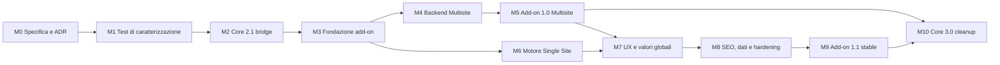

# Milestone e piano di consegna

## 1. Regole di esecuzione

1. Le milestone sono sequenziali salvo attività di test/documentazione esplicitamente indipendenti.
2. Ogni milestone termina con un gate verificabile; “codice scritto” non equivale a “milestone completata”.
3. Core e add-on hanno commit, pacchetti e certificazioni separati.
4. Nessuna migrazione distruttiva viene introdotta per accelerare una milestone.
5. Il backend Multisite viene reso stabile prima di dichiarare stabile il backend Single Site.
6. EasyRankly 3.0 non rimuove il fallback prima di almeno un ciclo di release reale dell'add-on Multisite.
7. Ogni implementazione parte da worktree controllata e preserva modifiche estranee già presenti.

## 2. Mappa delle dipendenze

M6 può iniziare dopo la fondazione tecnica, ma non va rilasciato prima che M5 abbia provato provider, packaging e lifecycle su installazioni reali.

## M0 — Specifica, ADR e perimetro

**Obiettivo:** congelare le decisioni che influenzano schema, compatibilità e prodotto.

**Complessità:** M.

### Deliverable

- documenti `README.md`, `ARCHITECTURE.md`, `SPECIFICATION.md` e `MILESTONES.md` approvati;
- ADR separate per modello Single Site, strategia URL, ownership/uninstall, provider API e scope stringhe globali;
- inventario verificato di file, hook, route, shortcode, opzioni, tabelle, asset e cleanup della baseline `origin/beta`;
- threat model e registro rischi;
- fixture Multisite anonima piccola e grande;
- formato del fingerprint di adozione.

### Gate

- Nessuna decisione P0 aperta.
- Nome, slug, namespace e versioni minime approvati.
- È esplicitamente escluso il motore TranslatePress-style dalla 1.x.
- Storage Single Site e policy di retention approvati.
- Ogni comportamento baseline è classificato: preservare, deprecare o correggere.

### Rollback

Solo documentale; nessun codice o dato applicativo deve essere stato modificato.

## M1 — Test di caratterizzazione del modulo incorporato

**Obiettivo:** creare una rete di sicurezza prima dell'estrazione.

**Dipendenze:** M0.

**Complessità:** L.

### Lavori

1. Creare una suite `multilingual-contract` eseguibile contro il provider incorporato e quello add-on.
2. Coprire registro siti/lingue, default, relazioni manuali, inferenza slug, home, post, termini e cancellazioni.
3. Fotografare output head, alternate SEO/navigabili, canonical, robots, shortcode, REST e asset.
4. Coprire draft, private, noindex tri-state, canonical manuale e `x-default`.
5. Aggiungere test di cache, creazione concorrente gruppi e capability cross-site.
6. Creare fixture con 3, 250 e 501 siti, oltre a una fixture multi-network.

### Gate

- Ogni requisito di parità Multisite ha almeno un test automatico nella suite `legacy-baseline`, che resta verde finché il fallback è supportato.
- I nove difetti elencati in `SPECIFICATION.md` hanno test separati nella suite `multisite-conformance`, inizialmente rossi e assegnati esplicitamente a M2 o M4.
- La suite fallisce dimostrabilmente se vengono avviati due resolver/emettitori.
- La baseline senza add-on è riproducibile da un ambiente pulito.

### Rollback

Rimuovere la sola suite; nessuna modifica allo storage di produzione.

## M2 — EasyRankly 2.1: release ponte

**Obiettivo:** introdurre il confine pubblico senza cambiare il comportamento degli utenti che non installano l'add-on.

**Dipendenze:** M1.

**Complessità:** XL; rischio bootstrap/lifecycle alto.

### Lavori core

1. Implementare `ERANKLY_EXTENSION_API_VERSION = 1`, interfaccia, registry e arbitraggio deterministico.
2. Adattare il modulo incorporato a provider fallback `easyrankly-bundled-multilingual`.
3. Eliminare il coupling a `$GLOBALS['erankly_ml_resolver']` e classi concrete dai consumer.
4. Estendere in modo retrocompatibile i filtri alternate/localized URL con contesto e provider ID.
5. Introdurre il contratto esatto `erankly_get_object_seo_state()` con output stabile.
6. Spostare hreflang fuori dal renderer meta aggregato e definire un unico callback provider `wp_head` anche con SEO owner esterno.
7. Congelare il solo descriptor `erankly_settings_tabs`/render action; Classic, Gutenberg e tassonomie restano superfici autonome dell'add-on.
8. Rendere reset e uninstall consapevoli del marker `erankly_ml_storage_owner`.
9. In multi-network, impedire cleanup globale se una rete è adottata o non verificata.
10. Aggiungere avvisi e diagnostica per provider rifiutato, API mismatch e stato claimed non avviabile.
11. Implementare lease/CAS per l'adozione, mutex condiviso su ogni writer di `erankly_settings`, merge su snapshot corrente, preservazione journal e toggle legacy interlocked off prima del claim.

### Test obbligatori

- ordine plugin core-prima/add-on-prima simulato;
- zero, uno, doppio e provider a pari priorità;
- registrazione tardiva e API mismatch;
- preflight fallito prima e dopo `claimed`;
- feature disabilitata senza riapparizione fallback;
- output e asset identici alla baseline senza add-on;
- reset/uninstall su installazione normale, Multisite e multi-network mista;
- callback legacy dei filtri registrati per un solo argomento.

### Gate

- EasyRankly 2.1 senza add-on supera integralmente la suite 2.0 e `legacy-baseline`; i soli test `multisite-conformance` assegnati a M4 possono restare rossi.
- Un fake provider può sostituire il fallback senza caricare file `ERankly_ML_*` runtime.
- In ogni scenario viene emesso al massimo un set hreflang.
- Il core non elimina storage con journal `pending`, `ready`, `error`, `rollback_ready`, owner add-on o tombstone `retained`.
- La release ZIP 2.1 è installabile e certificata autonomamente.

### Rollback

Il downgrade alla 2.0 è vietato finché lo storage è `claimed`. L'interlock lascia il toggle legacy spento anche se il downgrade viene forzato; la procedura supportata esegue verify/rollback su 2.1, ripristina il toggle e soltanto dopo installa la 2.0.

## M3 — Fondazione di EasyRankly Multilingual

**Obiettivo:** creare un plugin autonomo e dormiente in modo sicuro fuori dalla matrice supportata.

**Dipendenze:** M2.

**Complessità:** L.

### Deliverable

- repository/pacchetto `easyrankly-multilingual` indipendente;
- header plugin, runtime guard, autoload, text domain e namespace propri;
- provider ufficiale, composition root, topology detector e conflict detector;
- contratti/domain model e test di contratto backend;
- modalità `network-legacy`, `safe-readonly` e identificatore/skeleton non operativo `single-linked` per la futura 1.1;
- Site Health base e `wp erml status`/`verify` read-only;
- toolchain PHP/JS/CSS, `.distignore`, POT e pipeline packaging.

### Test obbligatori

- core assente, 1.x, 2.0, 2.1 e API major futura;
- add-on 1.0 su Single Site in `unsupported-topology` senza tabelle/routing, network activation e activation per-site rifiutata;
- add-on prima/dopo il core nell'ordine di caricamento;
- altro owner multilingua attivo;
- deactivation senza cancellazione;
- nessuna classe concreta caricata quando il runtime guard fallisce.

### Gate

- Nessuna dipendenza da file, URL, manifest o classi interne del core.
- Nessuna scrittura prima del preflight.
- Nessuna collisione di route, shortcode, handle o simboli.
- ZIP minimale installabile; Plugin Check preliminare senza finding azionabili P0/P1.

### Rollback

Disattivare l'add-on; nessun backend ha ancora eseguito takeover.

## M4 — Porting e adozione del backend Multisite

**Obiettivo:** raggiungere parità funzionale corretta usando lo storage legacy in-place.

**Dipendenze:** M3.

**Complessità:** XL.

### Lavori

1. Implementare `NetworkBackend` sopra tabella/opzioni legacy senza modificarne schema o ID.
2. Portare site registry, repository, resolver, REST, editor, shortcode, notice e asset nel namespace add-on.
3. Implementare journal `pending -> ready -> claimed`, fingerprint, audit e URL sampling.
4. Implementare `wp erml adopt` e `rollback` con conferma.
5. Sostituire inventari con limite 200 tramite paginazione/search server-side e batch keyset.
6. Validare default unico e hreflang univoci.
7. Uniformare resolver esplicito/inferito per SEO, navigazione e switcher.
8. Usare l'API di indexability del core.
9. Conservare alias REST e shortcode legacy senza doppia registrazione.
10. Rendere cache e lifecycle sicuri su multi-network e object cache persistente.
11. Aggiungere `erml_network_settings_v1`, sidecar revision/lock e REST field shim `erankly_ml_links`.
12. Precomputare a batch il frammento robots e servire soltanto la cache nella richiesta.
13. Separare `verify/adopt` dal comando esplicito e journaled `repair`.

### Test obbligatori

- reti subdirectory, subdomain e domain-mapped;
- 3, 250 e 501 siti;
- due network nello stesso database;
- relazione post/term/home, fallback slug ambiguo/non ambiguo;
- blog cancellato, oggetto orfano, gruppo incoerente;
- default/hreflang duplicati;
- REST forgiata, utente non membro e target non editabile;
- Redis/object cache persistente e invalidazione cross-request;
- interruzione dell'adozione in ogni transizione e retry idempotente;
- REST save/reset/uninstall concorrenti al lease, forced downgrade mentre claimed e due replace concorrenti nello stesso slot;
- crash injection dopo ogni scrittura di snapshot, toggle, marker e rollback, seguito da forced downgrade: nessun dual-write;
- save concorrente delle settings esattamente tra toggle verify e owner CAS: il mutex condiviso impedisce riattivazione/lost update;
- confronto fingerprint e snapshot URL prima/dopo.

### Gate

- Nessuna copia o dual-write dei dati.
- Conteggi e fingerprint invariati dopo takeover.
- Parità intenzionale HTML, REST, robots, editor e shortcode.
- Nessun limite di rete fisso.
- Rollback al fallback 2.1 verificato sullo stesso storage.
- Reset/uninstall core non modifica i dati adottati.
- `multisite-conformance` interamente verde; i dati invalidi bloccano adopt finché non viene approvato repair.

### Rollback

Su core 2.1, verificare il journal, rilasciare ownership e disattivare l'add-on. Non usare uninstall e non ripristinare il DB salvo divergenza attestata.

## M5 — EasyRankly Multilingual 1.0: release Multisite

**Obiettivo:** distribuire l'estrazione agli utenti Multisite mantenendo il fallback core.

**Dipendenze:** M4.

**Complessità:** L.

### Lavori

- completare wizard verify/adopt e report scaricabile;
- documentare ordine aggiornamento core -> add-on;
- aggiungere export/import `erml/1` per mappa e relazioni di rete;
- completare performance e security audit;
- preparare Upgrade Notice, FAQ rollback e runbook incidenti;
- testare il vero ZIP, non soltanto il checkout.

### Gate release

- matrice Multisite verde su versioni minime e correnti di WordPress/PHP;
- fixture >500 siti e multi-network verde;
- un ciclo beta/RC senza P0/P1 aperti;
- installazione, upgrade, deactivation, rollback e uninstall da ZIP verificati;
- checksum e contenuto artefatto registrati;
- core 2.1 resta fallback funzionante;
- documentazione non promette alternate XML non implementati.

### Rollback operativo

Disattivazione controllata dell'add-on e ritorno al provider core 2.1. I dati restano nella tabella legacy.

## M6 — Motore Single Site: storage, lingua, query e routing

**Obiettivo:** costruire il backend document-based senza ancora dichiararne la release stabile.

**Dipendenze:** M3; M5 stabile prima del rilascio pubblico.

**Complessità:** XXL; è la milestone più rischiosa.

### Lavori

1. Creare tabelle `erml_languages`, `erml_translation_groups`, `erml_object_languages`, `erml_localized_values`, `erml_translation_operations` e relativo schema versionato.
2. Implementare language registry, default/x-default e audit invarianti.
3. Implementare assegnazioni, gruppi, revisioni e mutazioni atomiche.
4. Implementare bootstrap/backfill a batch degli oggetti esistenti.
5. Implementare context resolver e freeze della lingua corrente.
6. Implementare directory routing, query var, pretty/plain permalinks e collision detector.
7. Filtrare `WP_Query` e `WP_Term_Query` con JOIN indicizzati e scope espliciti.
8. Coprire home, pagina articoli, singolari, archivi, search, feed e pagination.
9. Fornire API repository/URL resolver sufficiente ai test, senza anticipare tutta la UI.

### Test obbligatori

- nuova installazione e sito esistente con migliaia di oggetti;
- backfill interrotto/ripreso e passaggio compatibilità -> strict;
- permalink pretty e plain;
- default prefissato/non prefissato;
- lingua disabilitata: route pubblica 404, admin/preview autorizzati accessibili;
- conflitti con page/CPT/taxonomy base;
- post, page, CPT gerarchici/non gerarchici e termini;
- archivi, search, feed, pagination, preview e REST;
- richieste con lingua errata;
- concorrenza link/replace e revision conflict;
- EXPLAIN/indici e budget query.

### Gate

- Nessuna collisione route nelle fixture supportate.
- Oggetti di altre lingue non filtrano in archivi/search/feed.
- Disattivare l'add-on non modifica contenuti o permalink salvati.
- Backfill e schema upgrade sono idempotenti.
- Gli invarianti relazionali resistono ai test concorrenti.

### Rollback

Disattivazione; contenuti intatti e tabelle conservate. Se lo schema non è compatibile con la versione installata, safe-readonly anziché downgrade implicito.

## M7 — Authoring, frontend e valori globali Single Site

**Obiettivo:** rendere il motore utilizzabile editorialmente.

**Dipendenze:** M5 e M6.

**Complessità:** XL.

### Lavori

- Gutenberg panel, Classic metabox e pannello tassonomie;
- liste, filtri lingua, Quick Edit sicuro e bulk controllato;
- crea blank, duplicate, link, unlink, move e replace;
- manifest di duplicazione e mapping tassonomie/primary term;
- REST completa con optimistic locking e codici errore normativi;
- journal idempotency/compensazione per create blank/duplicate e cleanup dei soli record terminali;
- switcher blocco/shortcode/menu e translation notice;
- mapping homepage, pagina articoli e menu;
- tabella/registry dei valori globali localizzati con stato `needs_review`;
- traduzioni del plugin.

### Test obbligatori

- Gutenberg e Classic Editor;
- autosave, revision, lock editor e due editor concorrenti;
- due admin concorrenti su lingua/settings: una sola CAS riesce, l'altra riceve snapshot 409;
- post/term capability e IDOR;
- copia di ogni categoria del manifest, incluse esclusioni AI/runtime;
- create blank/duplicate sempre draft;
- due create concorrenti/idempotency retry con un solo draft e zero orfani;
- menu mancante e fallback;
- switcher con noindex/draft/missing/current;
- niente asset su pagine non interessate;

### Gate

- Tutti i workflow editoriali hanno test end-to-end.
- Nessuna pubblicazione automatica o copia di canonical/job/AI state.
- Nessuna chiave globale arbitraria è salvabile dal browser.
- UI coerente tra Gutenberg, Classic e termini.
- Set navigabile unico per switcher e notice.

### Rollback

Disattivazione conserva contenuti, relazioni e valori. Le traduzioni create restano normali draft/post WordPress.

## M8 — SEO, export/import, sicurezza e hardening Single Site

**Obiettivo:** completare i requisiti che rendono il backend rilasciabile.

**Dipendenze:** M7.

**Complessità:** XL.

### Lavori

1. Integrare alternate SEO/navigabili, canonical e ownership head.
2. Rendere language-aware WebSite, WebPage, Article, Breadcrumb e global schema.
3. Rendere sitemap cross-language e definire comportamento News.
4. Implementare export/import streaming con dry-run, mapping, journal e audit.
5. Completare Site Health e WP-CLI mutante con conferma.
6. Eseguire threat model, security suite e fuzzing degli input di route/import.
7. Misurare query, memoria, cache e asset su pacchetto reale.
8. Testare conflitti con owner multilingua e SEO esterni.

### Gate

- Hreflang reciproco/self/x-default e canonical superano gli scenari normativi.
- Noindex resta navigabile ma non SEO; draft non è pubblico.
- Schema usa URL e `inLanguage` coerenti.
- Sitemap non perde lingue per effetto del query filter.
- Export/import dry-run e rollback sono idempotenti.
- Nessun P0/P1 di sicurezza o performance.
- Compatibilità News viene dichiarata solo se testata; altrimenti è disabilitata/documentata.

### Rollback

Release trattenuta. Nessuna migration irreversible viene promossa a stable.

## M9 — EasyRankly Multilingual 1.1 beta, RC e stable

**Obiettivo:** validare il Single Site su installazioni reali controllate e pubblicare la 1.1.

**Dipendenze:** M8.

**Complessità:** L.

### Fasi

1. **Alpha interna:** fixture e siti effimeri; schema ancora modificabile.
2. **Beta opt-in:** backup obbligatorio, telemetry assente per default, report diagnostico manuale.
3. **RC:** schema congelato, soltanto fix P0/P1/P2 selezionati.
4. **Stable:** matrice e pacchetto certificati, runbook e rollback pubblicati.

### Gate

- almeno un ciclo beta e uno RC senza perdita dati;
- upgrade da add-on 1.0 Multisite non tenta conversione topologica;
- fresh install e upgrade beta precedenti verificati;
- nessun requisito MUST aperto;
- documentazione di limiti chiara: niente output translation, domini separati, slug uguali o bridge esterni;
- artifact ZIP install test e checksum completati.

## M10 — EasyRankly 3.0: rimozione definitiva dal core

**Obiettivo:** completare la richiesta originaria eliminando l'implementazione multilingua dal core.

**Dipendenze:** M5 stabile in produzione per almeno un ciclo e M9 completata. Il Single Site stable è un hard gate coerente con il grafo delle dipendenze.

**Complessità:** L, rischio compatibilità alto.

### Rimuovere dal core

- loader e file `includes/multilingual*`;
- classi `ERankly_ML_*`, globali e costanti storage/cache;
- route, shortcode, pannelli e configurazioni concrete;
- asset CSS/JS frontend/admin;
- attivazione/migrazione/reset/uninstall multilingua;
- documentazione che presenta la funzione come incorporata.

### Conservare nel core

- API provider major 1;
- filtri neutrali hreflang/navigable/localized URL/robots;
- sanitizzazione alternate;
- API indexability/canonical e extension point generici;
- shim deprecati strettamente necessari, senza implementazione o storage.

### Test obbligatori

- 3.0 con add-on attivo, assente e disattivato;
- upgrade 2.1 -> 3.0 con storage non adottato: dati lasciati intatti e avviso;
- upgrade 2.1 + add-on -> 3.0;
- downgrade 3.0 -> 2.1 controllato;
- uninstall core con add-on/storage presenti;
- ricerca statica nel sorgente e nel ZIP per simboli/file/storage legacy;
- nessun asset o route multilingua dal core.

### Gate

- Il pacchetto core non contiene implementazione multilingua.
- Assenza add-on significa assenza della funzione, mai fatal o cancellazione.
- Add-on continua a funzionare tramite API v1.
- Note di upgrade avvisano prima della major e indirizzano all'add-on.
- Diff semantico e pacchetto reale sono stati revisionati.

### Rollback

Downgrade a EasyRankly 2.1, che sa ancora leggere lo storage legacy. I dati non sono stati convertiti dal core 3.0.

## 3. Matrice minima di certificazione

### Runtime

| Dimensione | Celle minime |
|---|---|
| PHP | 8.0, 8.4, ultima supportata |
| WordPress | 6.2, ultima stable |
| Database | MySQL compatibile WordPress, MariaDB 10.11 |
| Topologia | Single Site, Multisite subdirectory, subdomain, domain mapping |
| Network size | 3, 250, 501 siti |
| Permalink | plain, pretty |
| Cache | assente, object cache persistente |
| Editor | Gutenberg, Classic, termini |
| Core | 1.x/2.0 negative, 2.1, ultima 2.x, 3.0-RC |
| Owner esterni | nessuno, multilingua conflict, SEO owner |

### Funzionalità

- post, page, CPT, term, home, posts page, archive, search, feed, sitemap;
- draft, pending, private, trash, noindex, canonical custom;
- default/x-default, lingua disabilitata, codice duplicato;
- esplicito/inferito Multisite;
- activation, migration interrupted/resume, adoption, rollback, reset, uninstall;
- REST permissions, nonce, IDOR, concurrency;
- export/import dry-run, conflict e partial failure;
- CSS/JS contextual loading;
- schema, canonical, hreflang e robots.

## 4. Gate di qualità e packaging

Ogni repository/ZIP DEVE superare autonomamente:

- PHP lint su tutti i file distribuiti;
- PHPCS con WordPress Coding Standards;
- PHPCompatibilityWP per PHP 8.0+;
- test unitari, integration e contract;
- ESLint, Stylelint e test JavaScript;
- versione Plugin Check e runtime pin in un manifest; strict + experimental sullo ZIP estratto, zero finding non soppressi, con ogni falso positivo verificato documentato puntualmente;
- controllo text domain/POT e licenza;
- due build indipendenti con inventario e hash contenuti normalizzati identici, più `.distignore` dedicato;
- `unzip -t`, inventario file e SHA-256;
- activation/upgrade/deactivation/uninstall dallo ZIP;
- sincronizzazione header, costante, changelog e `Stable tag`;
- Upgrade Notice WordPress.org sotto 300 caratteri;
- confronto semantico con la release precedente;
- worktree obbligatoriamente pulita per RC/stable;
- report con commit, ambiente e hash artefatto.

## 5. Registro rischi prioritari

| Rischio | Severità | Mitigazione / gate |
|---|---:|---|
| Doppio provider o doppio hreflang | P0 | Registry chiuso, test ordine/doppia registrazione |
| Uninstall core cancella dati adottati | P0 | Marker ownership, test multi-network e ZIP |
| Routing Single Site serve lingua errata | P0 | Context freeze, collision tests, E2E URL/canonical |
| Backfill rende contenuti invisibili | P0 | Unassigned compat, batch journal e conteggi |
| Concorrenza scollega traduzione | P1 | Unique keys, revision e 409 deterministico |
| Rete >200 troncata | P1 | Paginazione/keyset, fixture 501 |
| Noindex/hreflang incoerente | P1 | API indexability e due set separati |
| SEO owner esterno duplica output | P1 | Output arbitration e integration test |
| Scope cresce verso TranslatePress | P1 | Out-of-scope vincolante e ADR per ogni estensione |
| Slug identici promessi implicitamente | P1 | Conservare unicità WordPress, documentare limite |
| Certificazione solo sul sorgente | P1 | Test obbligatorio del vero ZIP/hash |

## 6. Ordine consigliato per l'implementazione con il modello successivo

Il passaggio a un modello con ragionamento “Alto” può iniziare da M1. Ogni task dovrebbe ricevere:

1. una sola milestone o sottosezione chiaramente delimitata;
2. i requisiti ID interessati;
3. file attesi e file esplicitamente fuori scope;
4. test da scrivere prima/durante la modifica;
5. gate e procedura rollback;
6. divieto di anticipare la milestone successiva.

La prima implementazione non deve creare subito il backend Single Site. La sequenza sicura è: caratterizzazione -> core bridge -> scheletro add-on -> parità Multisite -> release 1.0 -> motore Single Site.
